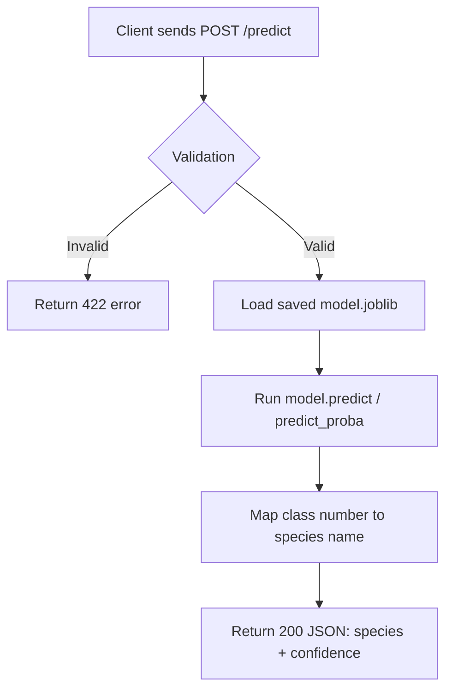

# Iris Classifier API

A REST API that predicts iris flower species from measurements, built to
practice production-style ML API engineering (not model complexity).

## Problem
Multi-class classification: given 4 flower measurements, predict the species
(setosa, versicolor, or virginica) using the classic Iris dataset.

## API Contract
`POST /api/v1/predict` accepts sepal length, sepal width, petal length, and
petal width (cm, positive floats) as JSON, and returns the predicted species
name plus a confidence score (0-1).

`POST /api/v2/predict` accepts the same input, but returns the full
probability distribution across all three species instead of a single
confidence score.

## Request Flow



## How to Run This Project

### Option 1: Docker Compose (recommended)
1. Ensure Docker Desktop is installed and running.
2. Create a `.env` file in the project root (see `.env.example` for the
   required variables).
3. Build and start the API:
   ```
   docker compose up --build
   ```
4. Visit http://127.0.0.1:8000/docs to explore and test the API.
5. Stop the API:
   ```
   docker compose down
   ```

The `ml/saved_model/` folder is mounted into the container as a volume, so a
retrained `model.joblib` can be dropped in and picked up by restarting the
container — no image rebuild required.

### Option 2: Local Python environment
1. Create and activate a virtual environment:
   ```
   python -m venv venv
   venv\Scripts\Activate.ps1
   ```
2. Install dependencies:
   ```
   pip install -r requirements.txt
   ```
3. Train the model (if `ml/saved_model/model.joblib` doesn't already exist):
   ```
   python ml/train.py
   ```
4. Run the server:
   ```
   uvicorn app.main:app --reload
   ```
5. Visit http://127.0.0.1:8000/docs

## Running Tests

```
pytest -v
```

## Example Requests (curl)

### Health check (no auth required)
```bash
curl http://127.0.0.1:8000/api/v1/health
```

### Single prediction (v1)
```bash
curl -X POST http://127.0.0.1:8000/api/v1/predict \
  -H "Content-Type: application/json" \
  -H "X-API-Key: YOUR_API_KEY" \
  -d '{"sepal_length": 5.1, "sepal_width": 3.5, "petal_length": 1.4, "petal_width": 0.2}'
```

### Single prediction (v2 — returns full probability distribution)
```bash
curl -X POST http://127.0.0.1:8000/api/v2/predict \
  -H "Content-Type: application/json" \
  -H "X-API-Key: YOUR_API_KEY" \
  -d '{"sepal_length": 5.1, "sepal_width": 3.5, "petal_length": 1.4, "petal_width": 0.2}'
```

### Batch prediction
```bash
curl -X POST http://127.0.0.1:8000/api/v1/predict-batch \
  -H "Content-Type: application/json" \
  -H "X-API-Key: YOUR_API_KEY" \
  -d '{"inputs": [
    {"sepal_length": 5.1, "sepal_width": 3.5, "petal_length": 1.4, "petal_width": 0.2},
    {"sepal_length": 6.7, "sepal_width": 3.0, "petal_length": 5.2, "petal_width": 2.3}
  ]}'
```

### Model metadata (no auth required)
```bash
curl http://127.0.0.1:8000/api/v1/model-info
```

### Prometheus metrics (no auth required)
```bash
curl http://127.0.0.1:8000/metrics
```

## Independent Extension: Continuous Integration

As an independent addition beyond the guided tasks, this project includes
a GitHub Actions workflow (`.github/workflows/tests.yml`) that automatically
installs dependencies, trains the model, and runs the full pytest suite on
every push and pull request to `main`. This was chosen to demonstrate a
basic CI practice: catching regressions automatically rather than relying
on manually remembering to run tests before pushing.

## What I Learned

Building this project taught me that the hard parts of a real API aren't
the model itself — the Iris classifier was almost trivial — but everything
around it. A few things that stood out:

- **Order of operations matters.** Auth, input validation, and business
  logic all run in a specific sequence, and getting that wrong (or not
  understanding it) breaks tests in confusing ways. Debugging why a test
  expected a 422 but got a 401 taught me more about how FastAPI actually
  processes a request than any tutorial did.
- **Versioning is a discipline, not just a URL prefix.** Keeping /api/v1
  completely untouched while building /api/v2 forced me to actually think
  about backward compatibility, not just add features.
- **Unit tests and load tests catch completely different problems.** My
  pytest suite passed cleanly, but a basic load test immediately exposed
  a concurrency bottleneck (99% failure under 100 concurrent requests) that
  no unit test would ever have caught.
- **Environment reproducibility is fragile in ways I didn't expect.**
  A OneDrive-synced project folder silently broke my git repository
  mid-project, and a Python version mismatch between my local machine and
  my Dockerfile caused a build failure that had nothing to do with my code.
  Both taught me to take "works on my machine" much less for granted.
- **Security has ripple effects.** Adding API key authentication
  broke several existing tests that had nothing to do with auth, since they
  simply hadn't been written with a required header in mind. It was a good
  lesson in how a single change can cascade through a codebase.