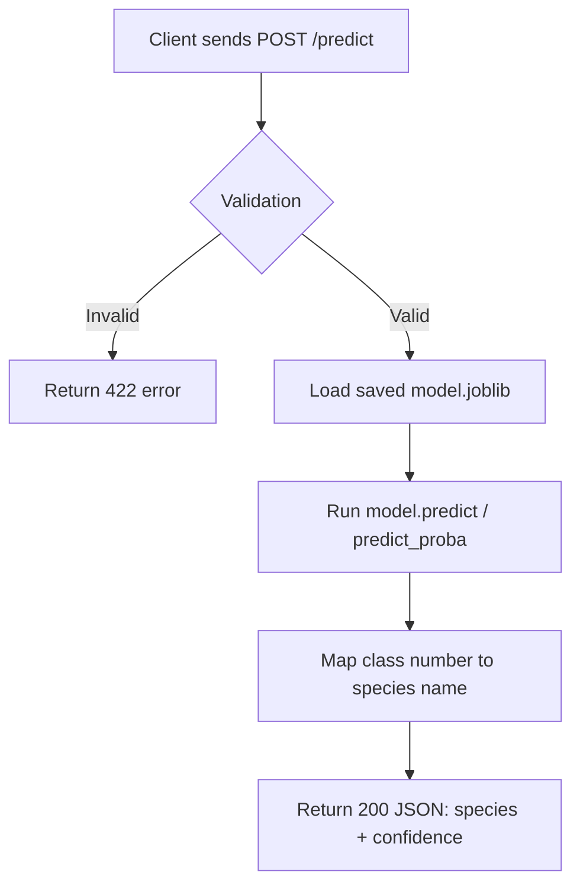

# Iris Classifier API

A REST API that predicts iris flower species from measurements, built to
practice production-style ML API engineering (not model complexity).

## Problem
Multi-class classification: given 4 flower measurements, predict the species
(setosa, versicolor, or virginica) using the classic Iris dataset.

## API Contract
`POST /api/v1/predict` accepts sepal length, sepal width, petal length, and
petal width (cm, positive floats) as JSON, and returns the predicted species
name plus a confidence score (0-1).

`POST /api/v2/predict` accepts the same input, but returns the full
probability distribution across all three species instead of a single
confidence score.

## Request Flow



## How to Run This Project

### Option 1: Docker Compose (recommended)
1. Ensure Docker Desktop is installed and running.
2. Create a `.env` file in the project root (see `.env.example` for the
   required variables).
3. Build and start the API:
   ```
   docker compose up --build
   ```
4. Visit http://127.0.0.1:8000/docs to explore and test the API.
5. Stop the API:
   ```
   docker compose down
   ```

The `ml/saved_model/` folder is mounted into the container as a volume, so a
retrained `model.joblib` can be dropped in and picked up by restarting the
container — no image rebuild required.

### Option 2: Local Python environment
1. Create and activate a virtual environment:
   ```
   python -m venv venv
   venv\Scripts\Activate.ps1
   ```
2. Install dependencies:
   ```
   pip install -r requirements.txt
   ```
3. Train the model (if `ml/saved_model/model.joblib` doesn't already exist):
   ```
   python ml/train.py
   ```
4. Run the server:
   ```
   uvicorn app.main:app --reload
   ```
5. Visit http://127.0.0.1:8000/docs

## Running Tests

```
pytest -v
```