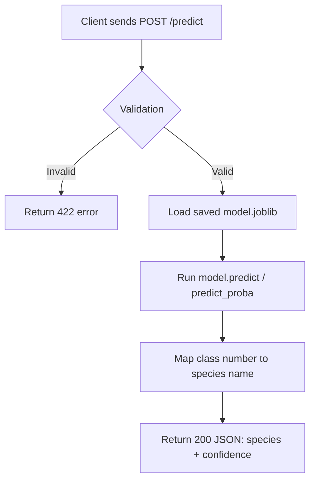

# Iris Classifier API

A REST API that predicts iris flower species from measurements, built to
practice production-style ML API engineering (not model complexity).

## Problem
Multi-class classification: given 4 flower measurements, predict the species
(setosa, versicolor, or virginica) using the classic Iris dataset.

## API Contract
`POST /predict` accepts sepal length, sepal width, petal length, and petal
width (cm, positive floats) as JSON, and returns the predicted species name
plus a confidence score (0-1).

## Request Flow

## Status
🚧 In progress — following a 5-phase, 20-task build plan.
- Task 1: Project planning
- Task 2: Environment & structure
- Task 3: Train & save model
- Task 4: Bare-bones FastAPI app